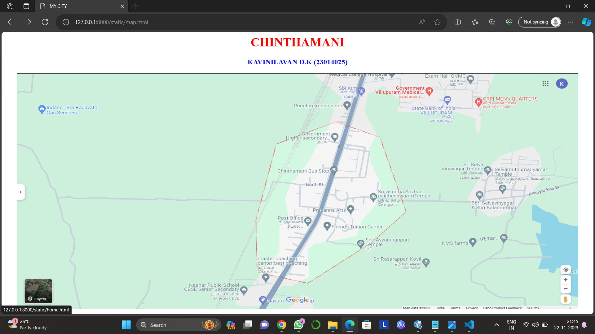

# Ex04 Places Around Me
## Date:22.11.2023
## AIM
To develp a website to display details about the places around my house.
## DESIGN STEPS

### STEP 1
Create a Django admin interface.

### STEP 2
Download your city map from Google.

### STEP 3
Using ```<map>``` tag name the map.

### STEP 4
Create clickable regions in the image using ```<area>``` tag.

### STEP 5
Write HTML programs for all the regions identified.

### STEP 6
Execute the programs and publish them.

## CODE
```
map.html


<html>
<head>
    <title>MY CITY</title>
    </head>
    <body>
        <h1 align="center">
            <font color="red"><b>CHINTHAMANI</b></font>
         </h1>
         <h3 align="center">
            <font color="blue"><b>KAVINILAVAN D.K (23014025)</b></font>
         </h3>
         <center>
            
            <map name="MYCITY">
                <area shape="rect" coords="600,150,1050,400" href="home.html" title="MY HOME TOWN">
                <area shape="circle" coords="1200,200,70" href="temple.html" title="sri selva vinayagar kovil">
                <area shape="rect" coords="1000,20,1100,80" href="hospital.html" title="government villupuram medical college">
                <area shape="rect" coords="1100,400,1200,500" href="farm.html" title="kms farm">
                <area shape="rect" coords="500,500,600,600" href="school.html" title="naahar public school">
            </map>
         </center>
    </body>
</html>

home.html

<html>
    <head>
        <title>MY HOME TOWN</title>

    </head>
    <body bgcolor ="pink">
        <h1 align=""centre">
        <font color="black"><b>CHINTHAMANI</b></font>
    </h1>
    <h3 align="centre">
        <font color="lavender"><b>MY HOME</b></font>
    </h3>
    <hr size="3" color="grey">
    <p align="justify">
<font face "Georgia" size="5"></font>
My home town was very pleasent and refreshable, it consists of farmland, wells, ponds, and a government higher secondary school.
And it has a temple which was built by Vikrama Chola king in the year of 1127, it has a good infrastucture. My house was suituated
near a national highway road and a government medical college is suituated nearly. And a petrol bunk also be suituated.
</p >
    </body>
</html>


school.html

<html>
    <head>
        <title>MY HOME TOWN</title>

    </head>
    <body bgcolor ="grey">
        <h1 align=""centre">
        <font color="red"><b>CHINTHAMANI</b></font>
    </h1>
    <h3 align="centre">
        <font color="blue"><b>NAAHAR PUBLIC SCHOOL</b></font>
    </h3>
    <hr size="3" color="lavender">
    <p align="justify">
<font face "Georgia" size="5"></font>
It is the CBSE school it is suituated in near by the national highways and it has a bus stop near it. It is cover with a 
greenland and it seems so beautiful infrastucture and it has a good records in results. They gives 100 percentage results
in  their higher exams. Some of them were in good positions today.
</p >
    </body>
</html>

hospital.html

<html>
    <head>
        <title>MY HOME TOWN</title>

    </head>
    <body bgcolor ="cream">
        <h1 align=""centre">
        <font color="red"><b>MUNDIYAMPAKKAM</b></font>
    </h1>
    <h3 align="centre">
        <font color="blue"><b>MEDIACAL GOVERNEMNT COLLEGE</b></font>
    </h3>
    <hr size="3" color="lavender">
    <p align="justify">
<font face "Georgia" size="5"></font>
The founder of this hospital was the honarable ex cm MU.Karunathi, it was built in 2007 and it has a beautiful view.
It has enough medical facilities and doctors. They are very caring the medcal college was good and faculties were so
caring and they elobrately tell the concept. 
</p >
    </body>
</html>

farm.html

<html>
    <head>
        <title>MY HOME TOWN</title>

    </head>
    <body bgcolor ="green">
        <h1 align=""centre">
        <font color="red"><b>MUNDIYAMPAKKAM</b></font>
    </h1>
    <h3 align="centre">
        <font color="blue"><b>KMS FARM</b></font>
    </h3>
    <hr size="3" color="lavender">
    <p align="justify">
<font face "Georgia" size="5"></font>
It is a small farm might cultivate crops like rice, millets, or sugarcane, reflecting the region's diverse agriculture.
 Farmers often use traditional methods and may face challenges like water scarcity. Livestock such as cows or goats could be part
  of the farm, contributing to the rural economy. The farm life there is closely tied to the seasons, with festivals and rituals
   often linked to agricultural cycles.
</p >
    </body>
</html>


temple.html

<html>
    <head>
        <title>MY HOME TOWN</title>

    </head>
    <body bgcolor ="white">
        <h1 align=""centre">
        <font color="red"><b>CHINTHAMANI</b></font>
    </h1>
    <h3 align="centre">
        <font color="blue"><b>SRI SELVA VINAYAGAR KOVIL</b></font>
    </h3>
    <hr size="3" color="lavender">
    <p align="justify">
<font face "Georgia" size="5"></font>
Temple is main deity is lorn vinayagar, he is the priyority amoung all gods.Very Devine! A must visit for vinayagar
 devotees, he have human body and elephant face . Temple on top of small hillock. Surrounding views are good.
The temple architecture is a fine example of the dravidian and there is a big vinayagar statue at the entrance.
In the temple is beautiful and it was located in the hillock. 
</p >
    </body>
</html>


```

## OUTPUT

.png>)
.png>)
.png>)
.png>)
.png>)
.png>)

## HTML VALIDATOR


## RESULT
The program for implementing image maps using HTML is executed successfully.
